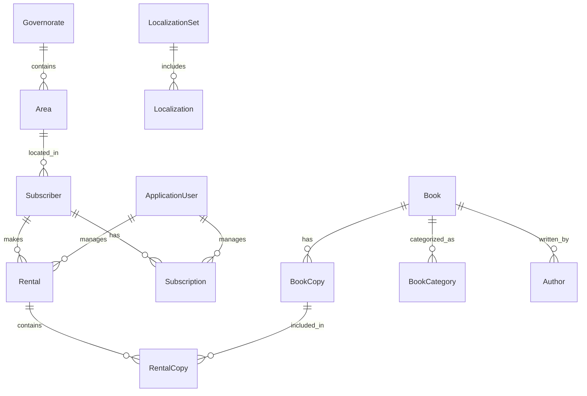

تفضل النسخة الجاهزة للنسخ واللصق، مع إضافة روابط التواصل كما طلبت:

---

# Bookify 📚 (.NET 7 MVC Web App)

Bookify is a modern, scalable library management system designed for book rental, subscriber management, and staff operations. It leverages best practices in .NET development, robust security, and a clean, maintainable architecture.

> **Note:** Bookify is a full-featured, production-ready system for managing books, rentals, subscribers, and staff roles in a library or similar organization.

---

## 🚀 Project Vision

Bookify aims to provide a robust backend and frontend for library management, enabling:

- Browsing, searching, and managing books and authors
- Managing subscribers, rentals, and subscriptions
- Role-based access for admins, archive staff, and receptionists
- Automated notifications for expiring rentals and subscriptions
- Multilingual support (English & Arabic)
- Secure authentication and user management

---

## 🛡️ Professional Features

Bookify is built with all the essential modules and best practices required for a modern, enterprise-grade web application:

- **User Management**: Registration, authentication, roles, and permissions (Admin, Archive, Reception)
- **Book & Author Management**: CRUD operations, search, filtering, and categorization
- **Subscriber & Rental Management**: Track subscribers, manage rentals, renewals, and blacklisting
- **Structured Logging** (Serilog): Centralized logs (file, JSON, SQL Server) for monitoring and debugging
- **Exception & Error Handling**: Consistent error responses and global exception management
- **Background Jobs** (Hangfire): Automated alerts for expiring subscriptions/rentals, email & WhatsApp notifications
- **Localization**: Full support for English and Arabic, with JSON-based resource files
- **Image Management**: Upload, resize, and store images (Cloudinary, ImageSharp)
- **Validation**: FluentValidation for robust server- and client-side validation
- **Security**: ASP.NET Core Identity, role-based authorization, anti-forgery, and data protection
- **Repository & Unit of Work Pattern**: Clean, testable data access
- **Clean Architecture**: Separation of concerns across Domain, Application, Infrastructure, and Web layers
- **Export & Reporting**: Export data to Excel, PDF, and CSV (ClosedXML, OpenHtmlToPdf)
- **Modern UI**: Bootstrap 5, jQuery, and responsive design
- **Health & Status**: Status code pages, error views, and health checks

---

## 🗄️ Database Design

### **Core Entities**

| Entity         | Description                                      | Status      |
| -------------- | ------------------------------------------------ | ----------- |
| ApplicationUser| System users (admin, staff, etc.)                | Implemented |
| Book           | Book records with categories, authors, copies    | Implemented |
| Author         | Book authors                                     | Implemented |
| Category       | Book categories                                  | Implemented |
| BookCopy       | Physical copies of books                         | Implemented |
| Subscriber     | Library subscribers                              | Implemented |
| Subscription   | Subscription records for subscribers             | Implemented |
| Rental         | Book rental transactions                         | Implemented |
| RentalCopy     | Individual book copies in a rental               | Implemented |
| Governorate    | Geographic region for subscribers                | Implemented |
| Area           | Sub-region for subscribers                       | Implemented |
| Localization   | Multilingual resource entries                    | Implemented |
| LocalizationSet| Grouping for localization entries                | Implemented |

---

### **Entity Relationship Diagram (Simplified)**



---

## 📦 Project Structure

```
Bookify/
├── Bookify.Domain/         # Domain entities, enums, and core logic
├── Bookify.Application/    # Application services, interfaces, DTOs
├── Bookify.Infrastructure/ # EF Core, repositories, data access
├── Bookify.Web/            # MVC UI, controllers, views, middlewares, tasks
│   ├── Controllers/
│   ├── Views/
│   ├── Middlewares/
│   ├── Tasks/
│   ├── Services/
│   ├── Resources/          # Localization files
│   ├── wwwroot/            # Static files (CSS, JS, images)
│   └── ...
├── Bookify.sln             # Solution file
└── ...
```

---

## 🛠️ Technologies Used

**Backend & Core:**
- ASP.NET Core 7 (MVC)
- Entity Framework Core (SQL Server)
- ASP.NET Core Identity (role-based auth)
- Hangfire (background jobs)
- Serilog (logging)
- AutoMapper (object mapping)
- FluentValidation (validation)
- Repository & Unit of Work Pattern
- Clean Architecture

**Frontend:**
- Bootstrap 5
- jQuery, Bootbox.js, Animate.css, Typeahead.js, Handlebars.js

**Other Integrations:**
- Cloudinary (image storage)
- ClosedXML (Excel export)
- OpenHtmlToPdf (PDF export)
- WhatsAppCloudApi (notifications)
- SixLabors.ImageSharp (image processing)
- ExpressiveAnnotations (advanced validation)

**DevOps & Tooling:**
- LibMan (client-side library management)
- User Secrets (local secrets management)
- Serilog sinks (file, JSON, SQL Server)

---

## ⚡ Getting Started

1. **Clone the repository:**
   ```bash
   git clone <your-repo-url>
   cd Bookify
   ```
2. **Configure your database connection:**
   - Edit `Bookify.Web/appsettings.json` with your SQL Server details.
3. **Restore dependencies:**
   ```bash
   dotnet restore
   ```
4. **Run EF Core migrations:**
   ```bash
   dotnet ef database update
   ```
5. **Start the application:**
   ```bash
   dotnet run --project Bookify.Web
   ```
6. **Access the app:**
   - Browse to [https://localhost:7183](https://localhost:7183) (or as configured).

---

## 📝 Roadmap

- [x] Core entities and relationships
- [x] Authentication & role management
- [x] Book, author, and rental management
- [x] Subscriber and subscription management
- [x] Multilingual support (EN/AR)
- [x] Logging & error handling
- [x] Background jobs & notifications
- [x] Data export (Excel, PDF, CSV)
- [ ] API endpoints (future)
- [ ] Docker support (future)
- [ ] Advanced reporting (future)
- [ ] Unit & integration tests (future)

---

## 🤝 Contributing

- Fork the repository and create feature branches.
- Follow .NET coding conventions and ensure code is well-documented.
- Write or extend unit/integration tests as needed.
- Submit clear and descriptive pull requests.

---

## 📄 License

This project is licensed under MIT.

---

## 📫 Contact

- **GitHub:** [OmarDiv](https://github.com/OmarDiv)
- **Email:** [Omaar88mohamed@example.com](mailto:Omaar88mohamed@example.com)

---

_Bookify is an independent project and not affiliated with any company or organization._

---

لو عاوز أي تعديل أو إضافة بلغني!
